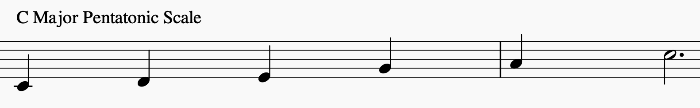
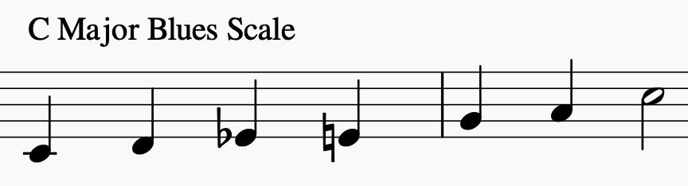

# Major Scale

Heptatonic, i.e. contains 7 notes

> Pick a root note, `R`, then find the rest of the notes using
> the formula of
>  
> `R W W H W W W`
>
> where W=whole step and H=half step

R | W | W | H | W | W | W |
- | - | - | - | - | - | - |
C | D | E | F | G | A | B |
G | A | B | C | D | E | F#|
D | E | F#| G | A | B | C#|
A | B | C#| D | E | F#| G#|
E | F#| G#| A | B | C#| D#|
B | C#| D#| E | F#| G#| A#|
F | G | A | Bb| C | D | E |
Bb| C | D | Eb| F | G | A |
Eb| F | G | Ab| Bb| C | D |
Ab| Bb| C | Db| Eb| F | G |
Db|	Eb| F | Gb| Ab| Bb| C |
Gb| Ab| Bb| Cb| Db| Eb| F |

## Major Pentatonic Scale

Contains 5 notes

> Pick a major scale and **remove the 4th and 7th degrees**

So, the C Major Pentatonic scale is:

`C D E G A`

## Major Blues Scale

Hexatonic, i.e. contains 6 notes 

> Pick a major pentatonic scale and **add a flattened 3rd**

Said another way:

> * Pick a major scale
> * Remove the 4th and 7th
> * Add a b3

So, the C Major Blues scale is:

`C D Eb E G A`

