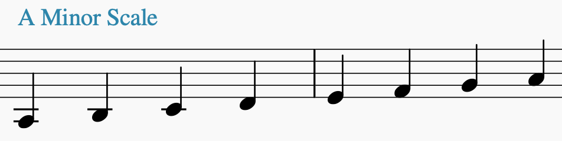

# Minor Scale

Heptatonic, i.e. contains 7 notes

## How to Find the Notes 
There are several ways to figure out the notes of a **natural minor** scale.

### Transform the major of the same key
This may be the easiest way.

> Start with the major scale of the same key and
>
> **flatten the 3rd, 6th, and 7th degrees**

| - | I | II | III | IV | V | VI | VII |
| - | - | - | - | - | - | - | - |
| A Major | A | B | C# | D | E | F# | G# |
| Formula | - | - | b  | - | - | b  | b |
| Am Natural (aka Aeolian) | A | B | C |D | E | F | G |

### Use the notes from the relative major

### Use W H W W H W

> Pick a root note, `R`, then find the rest of the notes using
> the formula of
>  
> `R W H W W H W`
>
> where `W`=whole step and `H`=half step

| R | W | H | W | W | H | W |
| - | - | - | - | - | - | - |
| A | B | C | D | E | F | G |

## Minor Pentatonic Scale
Contains 5 notes

> Pick a minor scale and **remove the 2nd and 6th degrees**

So, the A Minor Pentatonic scale is:

`A C D E G`

Another way to find the scale is to use the notes from the relative major's pentatonic scale but start from the root you've chosen.

## Minor Blues Scale

Hexatonic, i.e. contains 6 notes 

> Pick a minor pentatonic scale and **add a flattened 5th**

Said another way:

> * Pick a minor scale
> * Remove the 2nd and 6th degrees
> * Add a b5

Or another way:
> * Pick a major scale
> * Flatten the 3rd and 7th
> * Remove the 2nd and 6th
> * Add a b5

So, the A Minor Blues scale is:

`A C D Eb E G`

